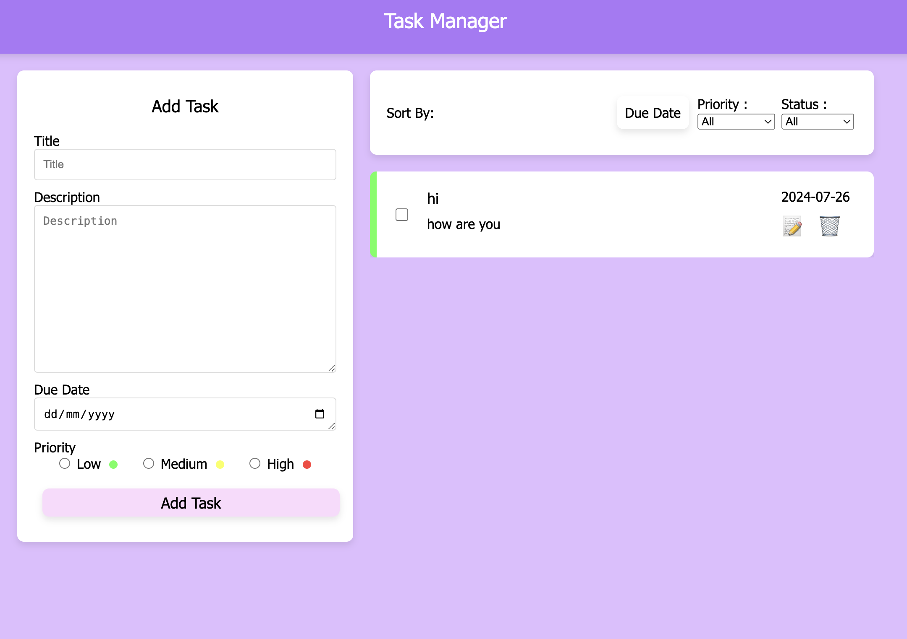

# Task Manager

## Overview

Task Manager is a simple yet powerful application designed to help you manage your tasks efficiently. This project allows you to create, edit, and organize tasks with important attributes such as title, description, due date, and priority. You can also sort your tasks based on priority, due date, and status. The application utilizes local storage to persist your tasks, ensuring your data is saved across sessions.

## Features

- **Create Tasks**: Add new tasks with a title, description, due date, and priority.
- **Edit Tasks**: Modify existing tasks to update their information.
- **Sort Tasks**: Organize your tasks by priority, due date, and status.
- **Local Storage**: Save tasks in the browser's local storage to persist data across sessions.

## Technologies Used

- Angular
- TypeScript
- HTML
- CSS

## Getting Started

### Prerequisites

Before you begin, ensure you have met the following requirements:

- Node.js installed on your machine
- Angular CLI installed globally

### Installation

1. Clone the repository:
   ```bash
   git clone https://github.com/yourusername/task-manager.git
2. Navigate to the project directory:
   ```bash
   cd task-manager
3. Install the dependencies:
   ```bash
   npm install

### Running the Application
1. Start the development server:
   ```bash
   ng serve
2. Open your browser and navigate to http://localhost:4200/.


### Deployment
The application is deployed and accessible at https://cn-task-manager.vercel.app/.

### Snapshot
